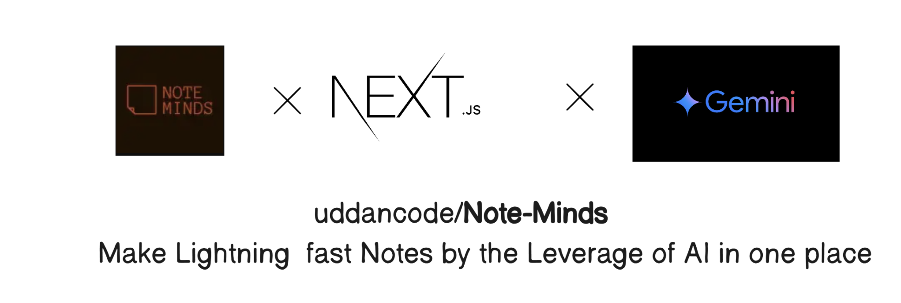

# 💥Introduction

Note-Minds is an AI-powered PDF note-taking web-application that transforms PDFs into interactive knowledge hubs which helps to make the notes from the PDFs as per the requirements making the notes shorter and crisper. The platform offers features like smart summarization and interactive note-taking. It's designed to help users learn faster and retain more information from their PDF documents.


## 🌐 Live Preview

Check out the live application here: [Note-Minds](https://note-minds.vercel.app/)

## 🌟 Features

- **AI-Powered Summarization**: Extracts key insights and generates smart summaries.
- **Interactive Note-Taking**: Create interactive notes to enhance learning.
- **Cross-Platform Synchronization**: Access your notes from any device.
- **Smart Pricing**: Start free, upgrade for more features.
- **Lightning Fast Processing**: Process PDFs in seconds.

## 💡 Why did I build this?

In the ongoing era of AI models like Chatgpt, Gemini and DeepSeek or other the LLM models, the need for efficient and interactive note-taking solutions has become essential. With the advent of Generative AI, I created Note-Minds specifically for students who study from PDFs. This platform allows them to make their notes crisper and shorter according to their requirements and queries, enhancing their learning experience by leveraging AI to provide tailored insights and summaries.


## 🎓 Benefits for Users

- **Enhanced Learning**: By transforming PDFs into interactive notes, students can engage with the material more effectively.
- **Time Efficiency**: AI-powered summarization helps the user quickly grasp key concepts, saving valuable study time.
- **Customization**: Users can tailor their notes to focus on areas they find most challenging or important.
- **Accessibility**: As **Note-Minds** is a web-application which allows the users for cross-platform synchronization ensures that users can access their notes anytime, anywhere, on any device.


## 🛠️ Tech Stack

- **Frontend**:   
- **Styling**:   
- **Authentication**: 
- **Backend/Database**: 
- **AI Integration**:  
- **PDF Processing**:    
- **Additional Features**:  

## ⚙️ Local Development

### Prerequisites

- Node.js
- npm

### Installation

1. Clone the repository:
   ```bash
   git clone https://github.com/yourusername/note-minds.git
   cd note-minds
   ```

2. Install dependencies:
   ```bash
   npm install
   ```

3. Run the Convex database:
   ```bash
   npx convex dev
   ```

4. Run the development server:
   ```bash
   npm run dev
   ```

5. Open your browser and visit `http://localhost:3000`.

### Linting

To lint the code files, run:
```bash
npm run lint
```

## 📜 License

This project is licensed under the MIT license.
